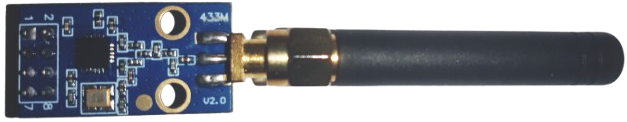

Final *Software and Computer Engineering* bachelor's project for **Insituto Superior de Engenharia de Lisboa**.

Developed By:
 - Rafael Conceição, student number 41486
 - Eduardo Tavares, student number 49454

# Branch specific information

This branch focuses on developing the connection between the esp32 and the application.
Unlike the main branch, all devices will use a previously existing network. With the usage
of multicast dns, the computer application controlling the nodes may be able to connect to 
every device at once.

## Esp-32 code

Connecting the esp-32 node to your local network will require your compiled code to have
your internate name and password. To avoid it being shared through github, these two pieces of
information were put on a header file, and added to a gitignore.

This means anyone trying to run the code ought to recreate the file found in [here](wifi_firmware_esp32/src/wifi_config/.gitignore). 2 string defines WIFI_NAME and WIFI_PASSWORD is all its needed (to confirm:
if no password is used it can be NULL)

## Compilation

Replaced arduino tools with platformio. See more information [here](docs/README.md).

## Terminal app

Removed in this branch. Completely focused on fltk gui

# Wi-Fi firmware for ESP32
## A Low-Cost Experimental Platform for Dense Wireless Networks

This repository contains the firmware for a wireless Medium Access Control (MAC) protocol implementation, developed for an ESP32 microcontroller development board (DOIT ESP32 DEVKIT V1) paired with a CC1101 radio module.

Hardware used in this project:
- CC1101 radio 

- [Esp 32 controller](https://www.flux.ai/blog/esp32-pinout-everything-you-need-to-know)

- Female to female cables connecting radio and Esp32, usb cable to connect to computer

Key software components include:

- MAC protocol implementation based on CSMA/CA, with RTS/CTS and NAV.

- Traffic generator for producing periodic network traffic.

- Terminal application for remote configuration and monitoring of the ESP32 nodes.

## Documentation

For information on how to set up the project, see the documentation [here](docs/).
